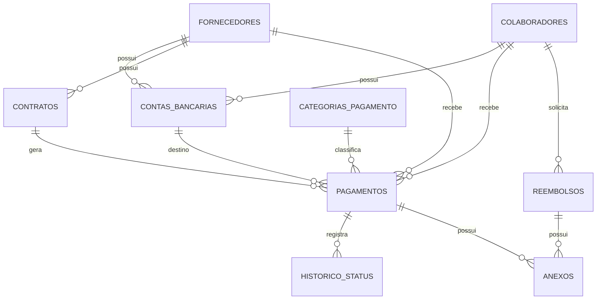

# Plano de Desenvolvimento, Sistema de Gestão de Pagamentos (Corebanx)

## 1. Visão geral

Sistema interno para a Corebanx controlar todo o ciclo de gestão de pagamentos da empresa, sem executar os pagamentos em si. O sistema registra, organiza e acompanha:

- Folha de pagamento de colaboradores (dados, contas bancárias, chaves Pix, valores, datas)
- Pagamento de fornecedores e prestadores de serviço contratados
- Reembolsos de colaboradores
- Contas bancárias e chaves Pix de todos os beneficiários
- Histórico e status de cada pagamento

**Fora de escopo (nesta primeira versão):** execução real de pagamentos (PIX/TED), integração com banco ou API de validação de chave Pix, importação automática de extratos, fluxo de aprovação em múltiplos níveis. Todos esses pontos foram desenhados para serem adicionados depois sem retrabalho estrutural (ver seção 7).

## 2. Premissas e decisões já tomadas

| Decisão | Definição |
|---|---|
| Uso | Interno, single-tenant (não é multi-empresa) |
| Aprovação | Não existe agora, mas o modelo de status já é extensível para isso no futuro |
| Integração externa | Nenhuma, registro 100% manual |
| Stack backend | Laravel |
| Stack frontend | Vue 3 (recomendação: com Inertia.js, ver seção 5) |

## 3. Módulos e regras de negócio

### 3.1 Colaboradores

- Cadastro com dados pessoais, cargo, departamento, tipo de contrato (CLT, PJ, estágio, autônomo), data de admissão e status (ativo, afastado, desligado).
- Um colaborador pode ter mais de uma conta bancária ou chave Pix cadastrada, mas apenas uma deve estar marcada como "principal" (destino padrão do salário).
- Ao desligar um colaborador, o sistema não apaga o histórico de pagamentos, apenas bloqueia novos lançamentos de folha a partir da data de desligamento. O desligamento pode gerar um lançamento avulso de rescisão.
- CPF é campo único e obrigatório.

### 3.2 Contas bancárias e chaves Pix

- Tabela compartilhada entre colaboradores e fornecedores (relação polimórfica), evitando duplicar estrutura.
- Cada registro guarda: banco, agência, conta, tipo de conta, titular, e opcionalmente uma chave Pix com seu tipo (CPF, CNPJ, e-mail, telefone, aleatória).
- Um beneficiário pode ter várias contas, mas o sistema deve garantir que exista sempre no máximo uma marcada como principal por beneficiário.
- Contas podem ser inativadas sem serem excluídas (preserva o histórico de pagamentos já feitos para aquela conta).

### 3.3 Fornecedores e prestadores de serviço

- Cadastro de pessoa física ou jurídica (CPF ou CNPJ), com tipo (fornecedor de produto, prestador de serviço, ou ambos).
- Fornecedor inativo não pode receber novos lançamentos de pagamento, mas mantém o histórico.
- Um fornecedor pode ou não ter um contrato vinculado (ver 3.4).

### 3.4 Contratos (serviços recorrentes)

- Usado para serviços contratados que se repetem (ex: contabilidade, aluguel, licença de software), com valor, periodicidade (mensal, quinzenal, anual) e dia de vencimento.
- Contratos pontuais não precisam de registro em contrato, o pagamento é lançado direto vinculado ao fornecedor.
- Contrato encerrado ou suspenso não gera novos lançamentos automáticos.

### 3.5 Categorias de pagamento

- Toda movimentação tem uma categoria (salário, décimo terceiro, férias, rescisão, fornecedor, serviço, reembolso, outro), usada para relatórios e filtros.
- Categorias são cadastráveis, não fixas em código, para o financeiro poder ajustar sem depender de deploy.

### 3.6 Pagamentos (módulo central)

- Todo pagamento tem: beneficiário (colaborador ou fornecedor), categoria, valor, data de vencimento, conta de destino, forma de pagamento (Pix, TED, boleto, dinheiro) e status.
- Status possíveis: **Pendente** (lançado, aguardando data), **Agendado** (usuário marcou intenção de pagar em data futura), **Pago** (confirmado manualmente, com data de pagamento preenchida), **Atrasado** (passou da data de vencimento sem confirmação), **Cancelado**.
- O sistema não processa o pagamento, o usuário apenas confirma manualmente que o pagamento foi feito e, se quiser, anexa o comprovante.
- Toda mudança de status fica registrada em um histórico (quem alterou, de qual status para qual, quando), para fins de auditoria interna.
- Pagamentos vinculados a um contrato recorrente devem ser gerados automaticamente (rotina agendada) alguns dias antes do vencimento, ficando com status Pendente até confirmação.

### 3.7 Reembolsos

- Colaborador (ou o financeiro em nome dele) registra uma solicitação de reembolso com valor, categoria de despesa (viagem, alimentação, material, transporte, outro) e comprovante anexado.
- Fluxo de status: Pendente, Aprovado, Pago, Rejeitado. Hoje sem regra de aprovação formal (ex: sem exigir um segundo usuário aprovando), mas o campo de status já contempla esses estados para quando a regra existir.
- Aparece de forma consolidada nos relatórios de pagamento junto com folha e fornecedores.

### 3.8 Anexos e comprovantes

- Tabela polimórfica única para anexos, usada por pagamentos, reembolsos e contratos.
- Armazena o arquivo, quem enviou e quando.

### 3.9 Usuários, perfis e permissões

- Usuários internos do sistema (não confundir com colaboradores, que são o objeto gerido). Um colaborador pode ou não ter um usuário de acesso ao sistema.
- Perfis sugeridos: Administrador (acesso total), Financeiro (lança e confirma pagamentos), Gestor (visualiza e solicita reembolsos da própria equipe), Leitura (relatórios apenas).

### 3.10 Auditoria

- Toda alteração relevante em colaboradores, fornecedores, contas bancárias e pagamentos deve ficar registrada (quem, quando, o que mudou), tanto para rastreabilidade financeira quanto para investigação em caso de erro de lançamento.

## 4. Modelo de dados

### colaboradores
| Campo | Tipo | Observações |
|---|---|---|
| id | bigint PK | |
| nome | string | |
| cpf | string | único |
| cargo | string | |
| departamento | string | |
| tipo_contrato | enum | CLT, PJ, estagio, autonomo |
| data_admissao | date | |
| data_desligamento | date, nullable | |
| salario_base | decimal | |
| email, telefone | string | |
| status | enum | ativo, afastado, desligado |
| observacoes | text, nullable | |
| timestamps + soft delete | | |

### fornecedores
| Campo | Tipo | Observações |
|---|---|---|
| id | bigint PK | |
| tipo_pessoa | enum | PF, PJ |
| razao_social / nome | string | |
| nome_fantasia | string, nullable | |
| documento | string | CPF ou CNPJ, único |
| tipo_fornecedor | enum | produto, servico, ambos |
| email, telefone, endereco | string | |
| status | enum | ativo, inativo |
| timestamps + soft delete | | |

### contas_bancarias (polimórfica)
| Campo | Tipo | Observações |
|---|---|---|
| id | bigint PK | |
| owner_type, owner_id | string, bigint | Colaborador ou Fornecedor |
| banco, agencia, conta, digito | string | |
| tipo_conta | enum | corrente, poupanca |
| titular_nome, titular_documento | string | |
| chave_pix | string, nullable | |
| tipo_chave_pix | enum, nullable | cpf, cnpj, email, telefone, aleatoria |
| principal | boolean | uma por beneficiário |
| status | enum | ativa, inativa |
| timestamps | | |

### contratos
| Campo | Tipo | Observações |
|---|---|---|
| id | bigint PK | |
| fornecedor_id | FK | |
| descricao | string | |
| tipo | enum | pontual, recorrente |
| valor | decimal | |
| periodicidade | enum, nullable | mensal, quinzenal, anual |
| dia_vencimento | integer, nullable | |
| data_inicio, data_fim | date | |
| status | enum | ativo, suspenso, encerrado |
| timestamps | | |

### categorias_pagamento
| Campo | Tipo | Observações |
|---|---|---|
| id | bigint PK | |
| nome | string | |
| tipo | enum | salario, ferias, decimo_terceiro, rescisao, fornecedor, servico, reembolso, outro |
| ativo | boolean | |

### pagamentos (núcleo)
| Campo | Tipo | Observações |
|---|---|---|
| id | bigint PK | |
| payable_type, payable_id | string, bigint | Colaborador ou Fornecedor |
| categoria_id | FK | |
| contrato_id | FK, nullable | quando gerado por contrato recorrente |
| conta_bancaria_id | FK | conta de destino |
| competencia | string, nullable | ex: 2026-08, usado em folha |
| descricao | string | |
| valor | decimal | |
| data_vencimento | date | |
| data_pagamento | date, nullable | |
| forma_pagamento | enum | pix, ted, boleto, dinheiro, outro |
| status | enum | pendente, agendado, pago, atrasado, cancelado |
| criado_por, atualizado_por | FK users | |
| observacoes | text, nullable | |
| timestamps + soft delete | | |

### historico_status
| Campo | Tipo | Observações |
|---|---|---|
| id | bigint PK | |
| historicoavel_type, historicoavel_id | string, bigint | Pagamento ou Reembolso |
| status_anterior, status_novo | string | |
| usuario_id | FK | |
| observacao | text, nullable | |
| created_at | | |

### reembolsos
| Campo | Tipo | Observações |
|---|---|---|
| id | bigint PK | |
| colaborador_id | FK | |
| descricao | string | |
| categoria | enum | viagem, alimentacao, material, transporte, outro |
| valor | decimal | |
| data_solicitacao | date | |
| data_pagamento | date, nullable | |
| status | enum | pendente, aprovado, pago, rejeitado |
| timestamps | | |

### anexos (polimórfica)
| Campo | Tipo | Observações |
|---|---|---|
| id | bigint PK | |
| anexavel_type, anexavel_id | string, bigint | Pagamento, Reembolso ou Contrato |
| nome_arquivo, caminho_arquivo | string | |
| tipo_arquivo, tamanho | string, integer | |
| enviado_por | FK users | |
| timestamps | | |

### Diagrama ER (mermaid, para referência e reuso em outras ferramentas)



## 5. Arquitetura técnica

### 5.1 Recomendação de stack

Como você já domina Laravel e o EcclésiaOS já roda em Laravel + Inertia + Vue, a recomendação é seguir a mesma combinação aqui: **Laravel + Inertia.js + Vue 3**. Isso evita manter uma API REST separada do frontend (menos código, menos pontos de falha), o que faz sentido para um sistema interno sem necessidade de app mobile nativo ou consumo externo da API.

**Backend**
- Laravel 11/12
- Autenticação via Laravel Breeze (stack Inertia) ou Fortify
- `spatie/laravel-permission`, perfis e permissões
- `spatie/laravel-medialibrary` ou storage nativo do Laravel, gestão de anexos e comprovantes
- `spatie/laravel-activitylog`, auditoria automática complementando a tabela `historico_status`
- `maatwebsite/laravel-excel`, exportação de relatórios em Excel/CSV
- `spatie/laravel-pdf` ou `barryvdh/laravel-dompdf`, exportação de relatórios em PDF
- Pest, testes automatizados

**Frontend**
- Vue 3 (Composition API) + TypeScript
- Inertia.js
- Tailwind CSS, reaproveitando a paleta já definida da Corebanx (laranja #F37B46, azul #214396, quase-preto #0D0E0E, cinza claro #EFEFEE)
- Biblioteca de componentes para telas administrativas com grids pesados: recomendo **PrimeVue**, tem DataTable pronto com paginação server-side, filtros por coluna e ordenação, o que poupa bastante tempo em telas como listagem de pagamentos e colaboradores. Alternativa mais leve, se preferir controle total do design: shadcn-vue + TanStack Table
- VeeValidate + Zod, validação de formulário no client espelhando as regras dos Form Requests do Laravel
- Day.js, manipulação de datas

### 5.2 Estrutura de pastas sugerida

```
app/
  Models/
  Http/Controllers/
  Http/Requests/
  Services/        (PagamentoService, ReembolsoService, ContratoRecorrenteService...)
  Policies/
resources/js/
  Pages/            (uma pasta por módulo: Colaboradores, Fornecedores, Pagamentos...)
  Components/
  Composables/
```

Regras de negócio mais complexas (ex: gerar pagamentos a partir de contratos recorrentes, mudar status com validação) ficam em Services, não direto no Controller, facilita testes e reuso.

## 6. Plano de execução

Estimativa total: 9 a 11 semanas, considerando um desenvolvedor full-stack dedicado. Pode ser fatiado em sprints de 2 semanas.

### Fase 0, Fundação (aprox. 1 semana)
- [ ] Setup do projeto Laravel + Inertia + Vue 3 + TypeScript + Tailwind
- [ ] Autenticação (login, recuperação de senha)
- [ ] Estrutura inicial de roles/permissions (Administrador, Financeiro, Gestor, Leitura)
- [ ] Ambientes de desenvolvimento e homologação
- [ ] Layout base aplicando identidade visual Corebanx

### Fase 1, Colaboradores e contas bancárias/Pix (aprox. 1 a 1,5 semana)
- [ ] Migrations e models: colaboradores, contas_bancarias (polimórfica)
- [ ] CRUD de colaboradores (listagem com filtros, cadastro, edição, desligamento)
- [ ] CRUD de contas bancárias/chaves Pix vinculado ao colaborador, com marcação de "principal"
- [ ] Validação de CPF e formato de chave Pix
- [ ] Testes automatizados básicos

### Fase 2, Fornecedores e contratos (aprox. 1 a 1,5 semana)
- [ ] Migrations e models: fornecedores, contratos
- [ ] CRUD de fornecedores (PF/PJ), reaproveitando o componente de contas bancárias
- [ ] CRUD de contratos vinculados a fornecedores
- [ ] Validação de CPF/CNPJ

### Fase 3, Categorias e pagamentos, módulo central (aprox. 2 semanas)
- [ ] Migrations e models: categorias_pagamento, pagamentos, historico_status
- [ ] CRUD de categorias
- [ ] Tela de lançamento de pagamento (beneficiário, categoria, conta destino, valor, vencimento)
- [ ] Comando artisan agendado para gerar lançamentos a partir de contratos recorrentes
- [ ] Fluxo de mudança de status manual, com registro em historico_status
- [ ] Upload de comprovante
- [ ] Listagem com filtros avançados (status, categoria, beneficiário, período)

### Fase 4, Reembolsos (aprox. 1 semana)
- [ ] Migration e model reembolsos
- [ ] Fluxo de solicitação de reembolso
- [ ] Upload de comprovante
- [ ] Mudança de status (pendente, aprovado, pago, rejeitado)

### Fase 5, Anexos e auditoria (aprox. 3 a 5 dias)
- [ ] Consolidar sistema de anexos polimórfico
- [ ] Implementar log de auditoria (activitylog)
- [ ] Tela de histórico por registro

### Fase 6, Relatórios e dashboard (aprox. 1 a 1,5 semana)
- [ ] Dashboard com indicadores (total a pagar no mês, pagamentos atrasados, por categoria)
- [ ] Exportação de relatórios (Excel/PDF) por período, categoria, beneficiário

### Fase 7, Permissões refinadas (aprox. 3 a 5 dias)
- [ ] Policies por módulo
- [ ] Ajuste fino dos perfis de acesso

### Fase 8, Testes, ajustes e deploy (aprox. 1 semana)
- [ ] Testes ponta a ponta dos principais fluxos
- [ ] Revisão de UX/UI
- [ ] Deploy em homologação e depois produção
- [ ] Documentação básica de uso

## 7. Pontos em aberto para decidir mais adiante

- **Fluxo de aprovação**: hoje o sistema não bloqueia nada por aprovação, mas o campo `status` de pagamentos e reembolsos já foi desenhado pensando nisso. Quando a regra existir, basta adicionar uma tabela `aprovacoes` (polimórfica, ligada a pagamentos e reembolsos) sem alterar o que já existe.
- **Integração bancária/Pix**: hoje 100% manual. Se no futuro quiser validar chave Pix via API ou importar extrato (OFX), isso entra como uma camada nova de Service sem mexer no modelo de dados atual.
- **Notificações**: lembretes de vencimento (e-mail interno, por exemplo) não estão no escopo inicial, mas são uma adição simples depois que o núcleo de pagamentos estiver estável.
- **Usuário colaborador com acesso próprio**: hoje pensado para uso do time financeiro/gestor. Se depois quiser que cada colaborador entre e solicite o próprio reembolso, a estrutura de usuários já comporta isso, é só liberar o perfil.
